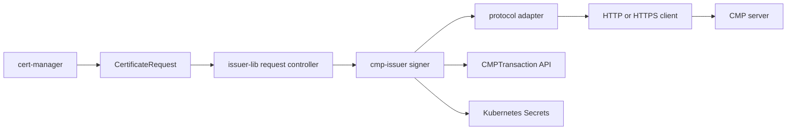

# Architecture

cmp-issuer is a cert-manager external issuer controller. It watches approved `CertificateRequest` resources that reference a `CMPIssuer` or `CMPClusterIssuer`, sends protected CMPv2 messages to a configured endpoint and returns issued certificates to cert-manager.

## Components

| Component | Role |
| --- | --- |
| **CRDs** | `CMPIssuer`, `CMPClusterIssuer` and `CMPTransaction` define issuer policy and in-flight transaction state |
| **issuer-lib** | Approval, denial, retry classification, Ready conditions and Events |
| **Signer** | Maps a `CertificateRequest` to a CMP enrollment, validates responses and writes the issued chain |
| **Protocol adapter** | Project-owned interfaces over go-pkicmp; no go-pkicmp types in public APIs |
| **HTTP client** | Bounded timeouts, response size, no redirects, optional TLS trust separate from CMP trust |

The Kubernetes CSR controller bundled with issuer-lib is **disabled**. cmp-issuer signs only through CMP.

## Reconciliation flow

1. cert-manager creates a `CertificateRequest` with a signed PKCS #10 CSR.
2. issuer-lib approves or denies the request. Unapproved or denied requests send **no** CMP traffic.
3. The signer loads issuer credentials and CMP trust from Secrets authorized by RBAC.
4. For P10CR the signer forwards the CSR bytes. It never reads the workload private key.
5. Before the first CMP message the signer creates a `CMPTransaction` owned by the `CertificateRequest`.
6. Protected DER is exchanged until the server returns a certificate or a permanent error.
7. The signer validates response protection, transaction ID, nonces, `certReqId`, issued public key and chain trust.
8. On success cert-manager stores the TLS Secret. The `CMPTransaction` is deleted.

## Asynchronous transactions

When the server answers `waiting`, the signer enters a poll loop. Poll intervals honor the server request within `minimumPollInterval` and `maximumPollInterval`. The transaction fails after `maximumDuration` or `maximumPolls`.

Transaction state in `CMPTransaction` includes the transaction identifier, deadline, phase, nonces, polled `certReqId`, validated response signer and poll count. A controller restart resumes from this state instead of starting a second enrollment.

Delayed confirmation is handled inline after the certificate is already issued. It is not recorded in `CMPTransaction`. See [Transaction recovery](guide/transaction-recovery.md).

## Trust separation

| Trust domain | Configuration | Purpose |
| --- | --- | --- |
| CMP response protection | `spec.cmpTrust` | Validate signed CMP messages and issued chains |
| HTTPS server | `spec.transport.tls.caSecretRef` | Validate the TLS server certificate |
| Workload TLS Secret | cert-manager | Store the issued leaf and chain for the workload |

CMP trust and TLS trust are independent. HTTP endpoints are supported and may report Ready with a warning about absent transport confidentiality.

## Security boundaries

* Credential Secret reads are namespace bounded. See [Credential Secret access](operations/secret-access.md).
* P10CR does not follow `cert-manager.io/private-key-secret-name`. See [Private-key handling](guide/private-key-handling.md).
* Protected CMP messages are mandatory. Unprotected responses are rejected.

See [Security model](security/security-model.md) and [Threat model](security/threat-model.md).
