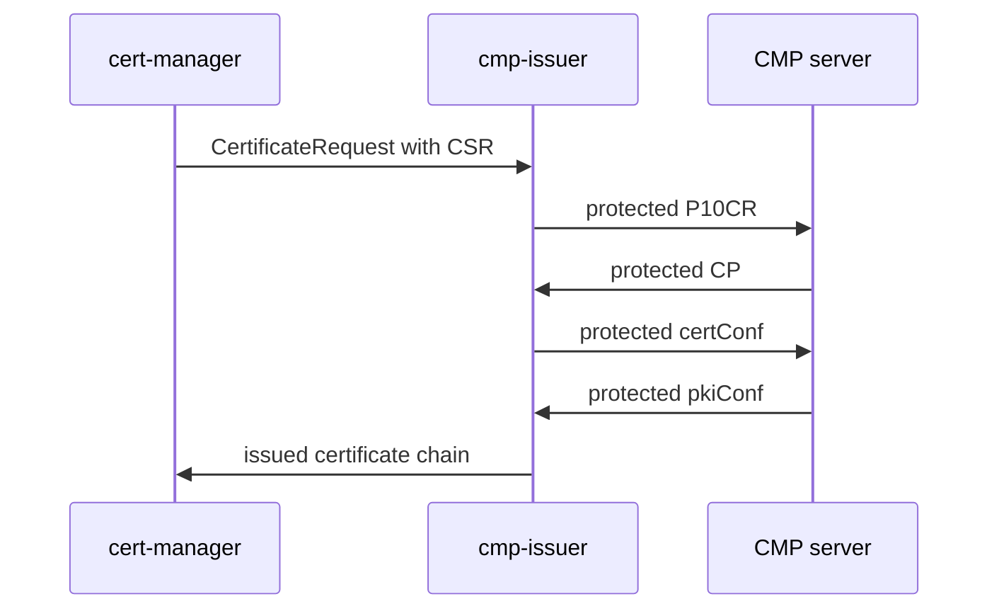

# Enrollment

Initial enrollment sends a protected P10CR with cert-manager's signed PKCS #10 CSR and completes when the server returns a validated CP.

## Flow



When the server grants implicit confirmation the `certConf` / `pkiConf` exchange may be omitted.

## Prerequisites

1. cert-manager installed and approving requests
2. cmp-issuer controller Ready
3. Issuer credential and CMP trust Secrets readable
4. For `CMPIssuer`: the issuer namespace authorized for credential reads, see [Credential Secret access](../operations/secret-access.md)
5. CMP server profile allowing P10CR with the chosen protection mode

## Configure the issuer

See [CMPIssuer](../reference/cmpissuer.md) or [CMPClusterIssuer](../reference/cmpclusterissuer.md). Set `protocol.initialEnrollment` to `P10CR`, which is the only implemented value.

## Request a certificate

```yaml
apiVersion: cert-manager.io/v1
kind: Certificate
metadata:
  name: workload-tls
spec:
  secretName: workload-tls
  issuerRef:
    name: my-cmp-issuer
    kind: CMPIssuer
    group: certmanager.misiektoja.github.io
  commonName: workload.example.com
  dnsNames:
    - workload.example.com
```

cert-manager creates a `CertificateRequest`. cmp-issuer reconciles it after approval.

## Inspect progress

```bash
kubectl describe certificaterequest <name>
kubectl get cmptransactions -n <namespace>
kubectl describe cmptransaction <name>
```

A `CMPTransaction` appears as soon as an enrollment starts and reports `Enrolling`, `Polling`, `Confirming` or `Issued`. It records the enrolled CSR digest, the issuer that served it and, once the server answers, the validated chain. It is removed with the `CertificateRequest` that owns it.

The controller log carries the same lifecycle as text. Each enrollment ends in one line naming the issuer, the endpoint, the CMP transaction and the issued certificate, and each wait, resumption and failure is logged as it happens. See [reading the controller log](../operations/troubleshooting.md#reading-the-controller-log).

## P10CR certReqId

RFC 9810 and RFC 9483 require `certReqId` `-1` in P10CR CP responses. Tested servers may return `0`. By default cmp-issuer accepts either value and echoes it in `certConf`. Pin a value with `spec.protocol.p10crResponseCertReqId` when needed.

## Granted modifications

When `spec.policy.grantedModifications` is `Reject`, certificates issued with `grantedWithMods` fail. Set `Accept` only when server-side field changes are expected and acceptable.

## Asynchronous enrollment

Servers that answer `waiting` trigger polling until a certificate arrives or limits expire. See [Transaction recovery](transaction-recovery.md).

## Related pages

* [Message protection](message-protection.md)
* [Tested PKIs](../interoperability/tested-pkis.md)
* [Troubleshooting](../operations/troubleshooting.md)
