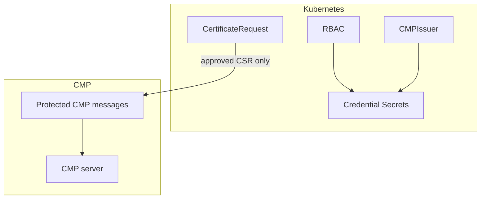

# Security model

This page summarizes how cmp-issuer enforces security goals. Detailed analysis lives in the [Threat model](threat-model.md).

## Goals

| Goal | Mechanism |
| --- | --- |
| Protect credentials | Namespace-bounded Secret RBAC, no secret values in logs or Events |
| Protect workload keys | P10CR never reads private-key Secrets |
| Reject forged CMP responses | Pinned PKIProtection mechanism, configured sender identity, transaction ID and nonce checks |
| Reject substituted certificates | CSR public-key match and CMP trust chain validation |
| Limit blast radius | Bounded timeouts, response size, poll counts and transaction duration |
| Fail closed on ambiguity | No partial TLS Secret on verification failure |
| Survive a restart without re-enrolling | Record the transaction and configuration identity before the first send and the validated chain before it is returned in a `CMPTransaction` |

## Trust boundaries

* **Kubernetes RBAC** gates configuration and credential access.
* **cert-manager approval** gates whether any CMP message is sent.
* **CMP PKIProtection** authenticates every request and response regardless of HTTP or HTTPS.
* **HTTPS** adds transport confidentiality when configured.

## cmp-issuer vs cert-manager responsibilities

| Responsibility | Owner |
| --- | --- |
| Workload private key generation and storage | cert-manager |
| CSR creation and signature | cert-manager |
| CMP enrollment and validation | cmp-issuer |
| TLS Secret for the workload | cert-manager after cmp-issuer returns the chain |

## Residual risks

* The CMP encoding layer is a pre-v1 library kept behind project-owned interfaces, maintained by this project's author and validated independently of its own checks. See [ADR 0001](../adr/0001-cmp-library.md).
* CMP interoperability depends on server configuration.
* A `CMPTransaction` records the transaction identifier, nonces, issuer identity, credential Secret versions and the issued chain. It holds no key material, credential values or protected message, so it cannot be used to enroll. Grant read access to `cmptransactions` as narrowly as you grant it to `certificaterequests`.
* Transaction persistence gaps leave specific ambiguous failure modes open. See [Known limitations](../known-limitations.md).

## Supply chain

Release artifacts, vulnerability scanning and credential scanning are described in [Provenance and supply chain](../provenance.md).

## Related pages

* [Private-key handling](../guide/private-key-handling.md)
* [Credential Secret access](../operations/secret-access.md)
* [Message protection](../guide/message-protection.md)
