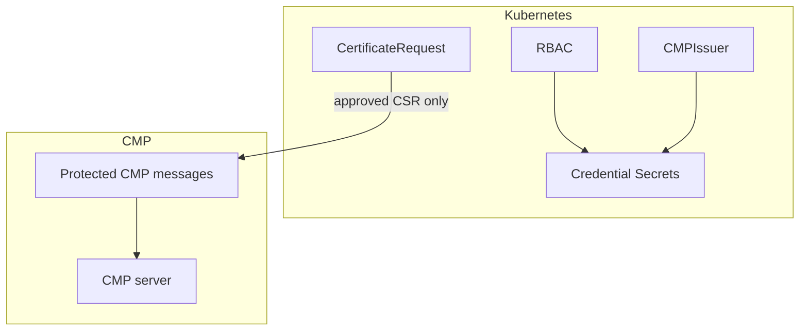

# Security model

This page summarizes how cmp-issuer enforces security goals. Detailed analysis lives in the [Threat model](threat-model.md).

## Goals

| Goal | Mechanism |
| --- | --- |
| Protect credentials | Namespace-bounded Secret RBAC, no secret values in logs or Events |
| Protect workload keys | P10CR never reads private-key Secrets |
| Reject forged CMP responses | Mandatory PKIProtection verification, transaction ID and nonce checks |
| Reject substituted certificates | CSR public-key match and CMP trust chain validation |
| Limit blast radius | Bounded timeouts, response size, poll counts and transaction duration |
| Fail closed on ambiguity | No partial TLS Secret on verification failure |

## Trust boundaries

* **Kubernetes RBAC** gates configuration and credential access.
* **cert-manager approval** gates whether any CMP message is sent.
* **CMP PKIProtection** authenticates every request and response regardless of HTTP or HTTPS.
* **HTTPS** adds transport confidentiality when configured.

## cmp-issuer vs cert-manager responsibilities

| Responsibility | Owner |
| --- | --- |
| Workload private key generation and storage | cert-manager |
| CSR creation and signature | cert-manager |
| CMP enrollment and validation | cmp-issuer |
| TLS Secret for the workload | cert-manager after cmp-issuer returns the chain |

## Residual risks

* go-pkicmp is pre-v1 and treated as a provisional dependency. See [go-pkicmp review](../dependencies/go-pkicmp-review.md).
* CMP interoperability depends on server configuration.
* Phase 4 persistence gaps leave specific ambiguous failure modes open. See [Known limitations](../known-limitations.md).

## Supply chain

Release artifacts, vulnerability scanning and credential scanning are described in [Provenance and supply chain](../provenance.md).

## Related pages

* [Private-key handling](../guide/private-key-handling.md)
* [Credential Secret access](../operations/secret-access.md)
* [Message protection](../guide/message-protection.md)
